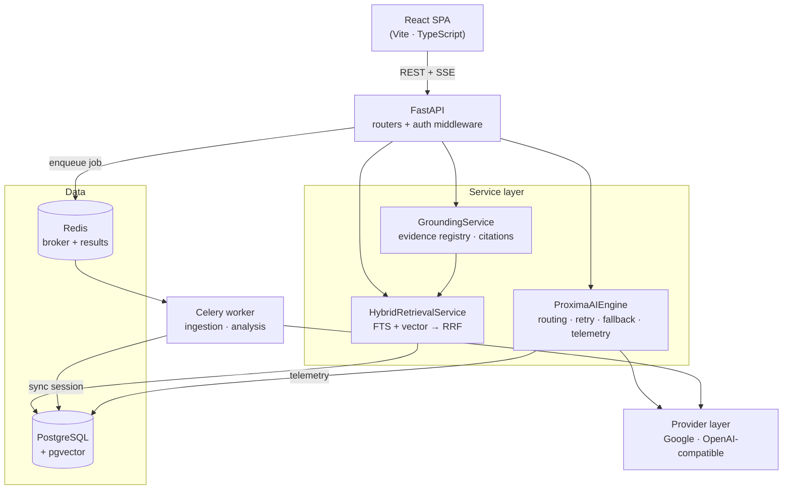

# Proxima

A document intelligence platform that answers questions about your documents with grounded, individually verifiable citations.

**🔗 Live demo:** **[proxima-arnav.duckdns.org](https://proxima-arnav.duckdns.org)** — sign in with Google, upload a document, and try Ask. (Self-hosted on a single VM; if it's briefly unavailable it's mid-restart.)

## Overview

Proxima solves a specific problem with LLMs over private documents: an answer that *sounds* right is worthless if you cannot check it. Proxima never lets the language model be the authority on what its sources were. Evidence is retrieved and registered server-side, the model's citation markers are validated against that registry, and any reference the model invents is stripped and reported rather than shown as fact.

The core workflow:

1. **Upload** — a PDF, DOCX, or TXT file is stored and a durable background job is created.
2. **Processing** — a Celery worker parses the document and splits it into chunks.
3. **Embeddings** — each chunk is embedded and stored in a pgvector column.
4. **Hybrid retrieval** — a question runs PostgreSQL full-text search *and* pgvector similarity search; the two ranked lists are fused with Reciprocal Rank Fusion.
5. **Grounded generation** — the retrieved evidence is assembled into a prompt and streamed through the model.
6. **Citations** — the response is reconciled against an authoritative evidence registry, producing citations that resolve to a real document, page, and snippet.

Questions can be scoped to a single document, an explicit set of documents, or the user's entire processed library. Scope is always resolved server-side from the authenticated user, so client-supplied document IDs can only narrow the set — never widen it.

## Key Features

- **Document ingestion** — PDF/DOCX/TXT upload with validation, parsing, and chunking
- **Durable background processing** — Celery + Redis with `acks_late`, retries, idempotent tasks, and a `BackgroundJob` lifecycle (`pending → running → completed/failed`)
- **Vector search** — pgvector with an HNSW cosine index
- **Full-text search** — PostgreSQL `tsvector` with a GIN index
- **Hybrid retrieval** — RRF fusion of both paths, with graceful degradation to FTS-only when embeddings are unavailable
- **Grounded responses** — evidence-constrained prompting with a grounding score and status (`grounded` / `unverified` / `insufficient_evidence`)
- **Authoritative citations** — `[Ref N]` markers validated against a server-built registry; invalid references are removed and reported
- **Cross-document intelligence** — library-wide and multi-document scopes, with a per-document cap so one document cannot dominate results
- **Streaming responses** — Server-Sent Events over a POST request
- **Model routing and fallback** — per-task-class routing rules with prioritised candidates and automatic failover
- **Analyzer suite** — general, legal, clinical, comparison, confidence audit, code, and domain-classification analyzers
- **Tenant isolation** — every document query is scoped to the owning user
- **Execution telemetry** — per-request model, token, cost, latency, and grounding outcome records

## Architecture



Two boundaries matter most:

- **The execution boundary.** All model calls go through `ProximaAIEngine`, which selects candidates from the model registry, retries, falls back, validates structured output, and records telemetry. Analyzers never call a provider SDK directly.
- **The retrieval/grounding boundary.** `HybridRetrievalService` resolves the authorized document scope before any search runs. `GroundingService` builds the evidence registry that citations are validated against, so citation authority stays on the server.

The API is async (SQLAlchemy + asyncpg); Celery workers use a separate synchronous session. Async provider calls made from a worker are bridged through a single shared event loop.

## AI / Intelligence Pipeline

- **Model registry** — `registered_models` records each model's provider, type, context window, embedding dimensions, and cost, plus which model is the active default for generation and for embeddings.
- **Provider abstraction** — a uniform interface (`complete`, `stream_completion`, `get_embedding`) implemented per provider, so provider details never leak into services.
- **Execution engine** — `ProximaAIEngine` accepts an `AIExecutionRequest` and returns a result or a typed error, handling candidate ordering, retries, fallback, and optional structured-output validation.
- **Embeddings** — generated through one shared boundary with both async (API) and sync (worker) entry points. The registry's dimension is requested explicitly so vectors match the `vector(768)` column. Failures return `None` rather than raising, leaving retrieval FTS-only.
- **Retrieval** — FTS and vector candidate lists, fused via RRF (`1/(60+rank)` per list), with optional per-document caps.
- **Grounding** — scores evidence availability, citation validity, and coverage, and classifies the result as grounded, unverified, or insufficient evidence.
- **Routing / fallback** — `model_routing_rules` maps a task class (optionally a domain) to prioritised models; the engine walks candidates in priority order.
- **Telemetry** — one request record and one grounding record per response. Prompt and response *content* are not persisted.

## Supported Analysis Capabilities

All under `/api/intelligence`:

| Endpoint | Purpose |
|---|---|
| `POST /complete` | Grounded Q&A with SSE streaming and citations (powers the Ask surface) |
| `POST /analyze` · `POST /analyze/async` | General document analysis, synchronous or as a durable job |
| `POST /legal` | Contract and legal analysis |
| `POST /clinical` | Clinical document analysis |
| `POST /compare` | Document comparison |
| `POST /confidence` | Deterministic confidence/quality audit |
| `POST /domain-radar` | Document domain classification and surface routing |
| `POST /code/{review,explain,docs,optimize,security}` | Code analysis suite |

Supporting routers: auth, users, documents, templates, exports, sessions, jobs, dashboard, and admin.

## Technology Stack

**Backend** — Python 3.11, FastAPI 0.111, SQLAlchemy 2.0 (asyncio), Alembic, Celery 5.4, Redis, PostgreSQL 16 with pgvector 0.3, asyncpg + psycopg2, Pydantic 2, python-jose (RS256 JWT), structlog

**AI providers** — `google-generativeai` (Gemini) and the `openai` SDK used against an OpenAI-compatible endpoint (Groq)

**Frontend** — React 18, TypeScript 5, Vite 5, Tailwind CSS 3, TanStack Query 5, Zustand, React Router 6, Axios, Framer Motion

**Tooling** — Docker Compose, Vitest, Playwright, pytest, ESLint

## Project Structure

```
.
├── backend/
│   ├── alembic/versions/       # migration chain (schema + registry/routing seeds)
│   ├── proxima/
│   │   ├── routers/            # FastAPI route modules
│   │   ├── services/
│   │   │   ├── execution/      # ProximaAIEngine, sync engine, telemetry auditor
│   │   │   ├── providers/      # per-provider adapters
│   │   │   ├── analysis/       # analyzer implementations
│   │   │   ├── retrieval_hybrid.py
│   │   │   ├── grounding.py
│   │   │   └── embedding.py
│   │   ├── models/             # SQLAlchemy ORM models
│   │   ├── schemas/            # Pydantic structured-output schemas
│   │   ├── tasks.py            # Celery tasks
│   │   └── celery_app.py
│   ├── scripts/                # operational scripts (embedding backfill)
│   └── tests/                  # unit + integration suites
├── frontend/
│   └── src/
│       ├── pages/              # route-level views
│       ├── components/         # UI, analysis shell, intelligence surface
│       ├── hooks/ · lib/       # streaming hook, SSE parser, API client
│       └── __tests__/
├── docs/
│   ├── PRD.md
│   └── DESIGN_SYSTEM.md
└── docker-compose.yml
```

## Local Development

**Prerequisites:** Docker and Docker Compose. Node.js is only needed to run frontend tooling outside the container.

**1. Clone and configure**

```bash
cp backend/.env.example backend/.env && cp frontend/.env.example frontend/.env
```

Fill in `backend/.env` — at minimum a `GEMINI_API_KEY`, the Google OAuth credentials, and the JWT keypair (generation commands are in the file's comments).

**2. Start the stack**

```bash
docker compose up -d
```

This starts PostgreSQL (pgvector), Redis, the API on `:8000`, the Celery worker, and the frontend dev server on `:5173`. PostgreSQL is reachable only inside the compose network as `db:5432`, so database commands must run inside a container.

**3. Apply migrations** (required on a fresh database — this is not automatic)

```bash
docker compose exec backend alembic upgrade head
```

**4. Rebuild after dependency changes** — `backend` and `worker` are separate images built from the same Dockerfile, so rebuild both:

```bash
docker compose build backend worker && docker compose up -d backend worker
```

## Production Deployment

Production uses a dedicated profile, `docker-compose.prod.yml`, which is separate
from the development stack: no source bind mounts, no `--reload`, the frontend is
a static build served by nginx (which also proxies `/api` to the backend so the
API is same-origin and cookies are first-party), the database and Redis are not
published to the host, and uploaded documents live on a persistent volume shared
by the API and the worker.

**1. Configure secrets.** Populate `backend/.env` from `backend/.env.example`
(session secret, RS256 JWT keypair, provider key, Google OAuth). In production,
missing `SESSION_SECRET`, JWT keys, `DATABASE_URL`, `CORS_ORIGINS`, or a provider
key cause the backend to fail on startup rather than serving traffic insecurely.

**2. Supply deployment variables** to Compose (via the shell or a root `.env`,
never committed): `POSTGRES_PASSWORD` (required), and optionally `CORS_ORIGINS`,
`VITE_API_URL` (the public origin, baked into the frontend at build time),
`FRONTEND_PORT`, and `EMBEDDING_RPM`.

**3. Deploy** with an explicit project name so it never collides with the dev
stack:

```bash
POSTGRES_PASSWORD=... CORS_ORIGINS=https://your.domain VITE_API_URL=https://your.domain \
  docker compose -p proxima_prod -f docker-compose.prod.yml up -d --build
```

Migrations run automatically: a one-shot `migrate` service applies
`alembic upgrade head` before the backend and worker start, so a fresh database
bootstraps to a usable schema (model registry, routing rules, and system prompts
are all migration-seeded) with no manual step.

**4. Verify readiness.** `GET /api/health` returns `200` only when the database
and Redis are reachable (`503` otherwise); `GET /api/health/live` is a plain
liveness probe.

For a real deployment, set `GOOGLE_REDIRECT_URI` to `https://your.domain/api/auth/callback`
and serve over HTTPS (secure cookies are enabled automatically in production).

## Environment Variables

Backend (`backend/.env.example`) — never commit real values:

| Variable | Purpose |
|---|---|
| `DATABASE_URL`, `REDIS_URL` | PostgreSQL and Redis connections |
| `CELERY_BROKER_URL`, `CELERY_RESULT_BACKEND` | Celery broker and result store |
| `GOOGLE_CLIENT_ID`, `GOOGLE_CLIENT_SECRET`, `GOOGLE_REDIRECT_URI` | Google OAuth login |
| `JWT_PRIVATE_KEY`, `JWT_PUBLIC_KEY`, `JWT_ALGORITHM` | RS256 token signing |
| `SESSION_SECRET`, `ACCESS_TOKEN_EXPIRE_MINUTES`, `REFRESH_TOKEN_EXPIRE_DAYS` | Session/token policy |
| `GEMINI_API_KEY`, `OPENAI_API_KEY`, `ANTHROPIC_API_KEY` | Provider credentials |
| `CORS_ORIGINS`, `FRONTEND_URL` | Browser origin allow-list |
| `AWS_*` | Optional S3 storage (falls back to local storage) |
| `MONTHLY_AI_BUDGET_USD`, `COST_ALERT_THRESHOLD` | Budget controls |
| `SENTRY_DSN` | Optional error reporting |

Frontend (`frontend/.env.example`): `VITE_API_URL`, `VITE_POSTHOG_KEY`.

## Testing

Backend tests need the database, so run them inside the container. Scope to `tests/` — a standalone parser script at the backend root is not part of the suite:

```bash
docker compose exec backend python -m pytest tests/ -q
```

Frontend:

```bash
cd frontend && npm run test && npm run lint && npm run build
```

## Security / Design Notes

- **Tenant isolation.** Every document and chunk query is filtered by the authenticated user's ID. Cross-tenant access returns 403.
- **Server-side scope resolution.** The retrieval scope is computed from the session user; client-supplied document IDs or a library scope can only intersect that set.
- **Citation authority is server-side.** The evidence registry is built from retrieved chunks before generation. Model-emitted references are validated against it and invalid ones are stripped and counted — the model cannot invent a source.
- **Secrets are not committed.** Only `.env.example` templates are tracked; real `.env` files are git-ignored.
- **Telemetry stores no payloads.** Request records keep model, token counts, cost, and latency; grounding records keep scores and citation metadata. Prompts and responses are not persisted.

This project makes no regulatory compliance claims. Do not upload regulated personal or health data.

## Current Limitations

- **Token usage is estimated**, not read from provider usage metadata, so cost figures are approximate.
- **Browser E2E is not automated.** A Playwright config exists, but current verification is API-level and unit-level.
- **Answers are not persisted.** Ask results are streamed and then discarded — there is no conversation history or saved-answer view.
- **Provider dependency.** Generation and embeddings require a reachable provider; embedding failures degrade retrieval to FTS-only rather than failing the request.
- **"Insufficient evidence" is conservative.** Detection depends on the model signalling it cannot answer, so some weakly-supported answers are still labelled grounded.
- **Citations are model-dependent.** They resolve to real document/page metadata when present, but the model must emit `[Ref N]` markers; on short answers it sometimes omits them even when grounded.
- **Templates and domain knowledge are not migration-seeded.** System prompts now are (so analyzers use domain prompts on a fresh database), but the Templates page and domain-knowledge chunks start empty.
- **Text extraction only.** Scanned documents without a text layer are rejected; there is no OCR, and tables and images are not specially handled.

## Roadmap

- Persisted Ask sessions so answers can be revisited and continued
- Stronger evidence-sufficiency detection informed by real usage
- Object storage (S3) as an alternative to the shared volume for multi-host scale
