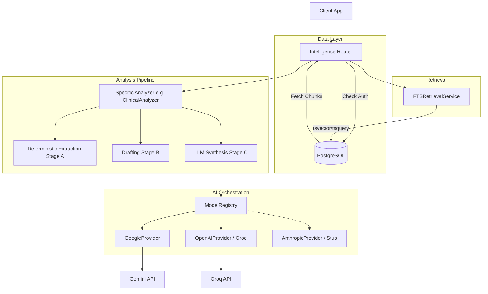

# Stage 7A.1 — Proxima Intelligence Architecture Audit

This document is a read-only, evidence-based audit of the current Proxima AI/intelligence architecture. It was generated by inspecting the source code as it exists in the codebase today, with no modifications made.

---

## 1. Model & Provider Layer

**Current Behavior:**
The system uses a centralized `ModelRegistry` to handle provider dispatch. It supports routing logic based on `provider`, `model_id`, and `fallback_chain`. However, the underlying provider implementations are in varied states of completion.

**Evidence:**
- **File:** `backend/proxima/services/model_registry.py`
  - **Class:** `ModelRegistry`
  - **Behavior:** Fetches model configurations from the DB. Implements `get_default_generation` and routing logic.
- **File:** `backend/proxima/services/providers/google_provider.py`
  - **Behavior:** Implements the `google-generativeai` SDK natively. Currently the primary, fully functional provider, defaulting to `gemini-2.5-flash`. Supports streaming natively.
- **File:** `backend/proxima/services/providers/anthropic_provider.py`
  - **Behavior:** Completely stubbed. Both `generate` and `stream` methods raise `NotImplementedError("Anthropic provider not yet implemented.")`.
- **File:** `backend/proxima/services/providers/openai_provider.py`
  - **Behavior:** Uses the OpenAI SDK, but is hardcoded to connect to the Groq API (`base_url="https://api.groq.com/openai/v1"`).

**Final Constraints & Gaps:**
- Anthropic support is missing.
- OpenAI provider is actually a Groq adapter. True OpenAI integration (or Azure OpenAI) is missing if needed.
- `google_provider.py` relies on `gemini-2.5-flash` specifically, though it reads from the DB model definition.

---

## 2. Prompt Engineering Layer

**Current Behavior:**
Prompts are stored dynamically in the PostgreSQL database rather than being hardcoded in files. A registry service fetches them, and an assembler injects runtime context.

**Evidence:**
- **File:** `backend/proxima/services/prompt_registry.py`
  - **Class:** `PromptRegistryService`
  - **Behavior:** Defines a `get_system_prompt(name, version)` method to fetch prompt templates (like `system_clinical`, `system_legal`) from the `system_prompts` table.
- **File:** `backend/proxima/services/prompt_assembler.py`
  - **Class:** `PromptAssemblerService`
  - **Behavior:** Combines the system prompt template, the retrieved context string (packaged by FTS), and the user's specific task.

**Final Constraints & Gaps:**
- The prompt system is completely centralized in the DB. This is highly dynamic but means version control and migration of prompts require database seeds or UI tools.
- Context injection is a simple string interpolation of the retrieved context package.

---

## 3. Analyzer Architecture

**Current Behavior:**
Most specialized analyzers (Contract, Clinical, General) follow a rigid three-stage "Deterministic-to-LLM Synthesis" pattern. 

**Evidence:**
- **File:** `backend/proxima/services/contract_analyzer.py` (and similarly `clinical_analyzer.py`, `general_document_analyzer.py`)
  - **Behavior:** 
    - **Stage A (Deterministic):** Uses regex/heuristics to extract word counts, legal entities, clauses, and risk flags (e.g., `build_document_profile`, `extract_legal_entities`).
    - **Stage B (Drafting):** Builds a structured "Draft" dictionary from deterministic outputs.
    - **Stage C (LLM Synthesis):** Passes the draft and original text to the LLM via `model_registry.get_default_generation()`.
    - **Fallback:** Provides a strict, deterministic-only fallback response if the LLM call fails (`_build_fallback_response`).
- **File:** `backend/proxima/services/code_suite_service.py`
  - **Behavior:** Follows a similar pattern. Deterministic stage detects language (`detect_language`), counts lines/functions, and detects basic review signals (e.g., `eval()`, `SELECT *`). Stage B passes this to an LLM enforcing a strict JSON schema for Explain/Review/Docs operations.

**Final Constraints & Gaps:**
- The analyzers heavily rely on predefined regex lists for their "Stage A" heuristics (e.g., matching "shall", "indemnify"). This works but is fragile against varied vocabulary.
- The dual-pass approach means every analysis operation relies on Python CPU-bound regex processing before hitting the LLM.

---

## 4. Document Pipeline & Retrieval Architecture

**Current Behavior:**
Document ingestion uses standard chunking, and retrieval relies entirely on PostgreSQL Full Text Search (FTS). **There is no vector database or pgvector implementation.**

**Evidence:**
- **File:** `backend/proxima/services/chunking.py`
  - **Behavior:** Simple character-based chunking with boundaries (default 1000 characters, 100 character overlap). Looks backwards for spaces/newlines to avoid cutting words in half.
- **File:** `backend/proxima/services/retrieval_fts.py`
  - **Class:** `FTSRetrievalService`
  - **Behavior:** Uses PostgreSQL `to_tsvector` and `plainto_tsquery` to rank and retrieve chunks. It explicitly returns a packaged context string formatted as `[Excerpt X | Relevance: Y]`.
- **File:** `backend/proxima/services/domain_radar.py`
  - **Behavior:** Uses regex to score domains (Clinical, Legal, Academic, Technical, Business). Top candidates are passed to an LLM (Gemini specific logic hardcoded here occasionally) to finalize the classification and recommend surfaces.

**Final Constraints & Gaps:**
- Semantic search does not exist. A query for "monetary compensation" will not match "payment" unless the FTS dictionaries are heavily customized.
- Chunking is naive (character-based) rather than semantic (sentence/paragraph/AST based).

---

## 5. Quality & Confidence (QHE)

**Current Behavior:**
Quality and Confidence evaluations are entirely deterministic and heuristic-based. No "LLM-as-a-judge" is currently used.

**Evidence:**
- **File:** `backend/proxima/services/qhe.py`
  - **Class:** `QualityHeuristicEngine`
  - **Behavior:** Scans AI responses for "hedge phrases" (e.g., "i am not sure", "as an ai") and "risk phrases" (e.g., "medical advice"). Deducts points from a base score of 90 to determine High/Medium/Low quality.
- **File:** `backend/proxima/services/confidence_analyzer.py`
  - **Class:** `ConfidenceAnalyzer`
  - **Behavior:** Analyzes raw document text for Clarity, Structure, Terminology, and Compliance Signals using purely mathematical/regex heuristics (e.g., average sentence length, heading ratios, acronym count).

**Final Constraints & Gaps:**
- The QHE is extremely brittle. It penalizes specific strings and cannot evaluate actual factual accuracy, hallucination, or nuance.
- Confidence scoring is based on structural assumptions (e.g., average sentence length of 15-20 is "optimal"), which may not hold true across diverse document types.

---

## 6. Async & Background Processing

**Current Behavior:**
Background processing infrastructure is configured but entirely unused for intelligence workloads. All AI tasks run synchronously in the HTTP request cycle.

**Evidence:**
- **File:** `backend/proxima/celery_app.py`
  - **Behavior:** Configures a Celery app with queues for `ai`, `embeddings`, `exports`, and `maintenance`.
- **File:** `backend/proxima/tasks.py`
  - **Behavior:** Contains only a single `dummy_task()`.
- **File:** `backend/proxima/routers/intelligence_router.py`
  - **Behavior:** All endpoints (e.g., `/analyze`, `/clinical`, `/legal`, `/complete`) `await` the analyzer services directly. No Celery tasks are dispatched. The operations block the FastAPI worker (or stream the response) while waiting for the LLM.

**Final Constraints & Gaps:**
- Long-running document analysis tasks (like analyzing a 100-page PDF) will block or timeout the HTTP request.
- The `ai` and `embeddings` Celery queues exist in configuration but handle zero production traffic.

---

## 7. Response Validation

**Current Behavior:**
Pydantic schemas are heavily used to structure expected analysis formats, but LLM JSON generation is sometimes hardcoded with inline schemas rather than pulling directly from Pydantic models.

**Evidence:**
- **File:** `backend/proxima/schemas/general_analysis.py`
  - **Behavior:** Defines strict `GeneralAnalysisResult`, `Takeaway`, `NumericalInsight` etc. schemas with detailed field descriptions.
- **File:** `backend/proxima/services/domain_radar.py` & `code_suite_service.py`
  - **Behavior:** Manually constructs a JSON schema dict (e.g., `"type": "OBJECT", "properties": {...}`) and passes it to `genai.GenerationConfig(response_schema=schema)`.

**Final Constraints & Gaps:**
- There's a risk of drift between the Pydantic schemas (used for API responses) and the inline schemas sent to the LLM.
- No automatic retry or self-correction loops exist if the LLM fails to match the schema (though Gemini's structured output generally guarantees it, Groq/OpenAI implementations manually ask for JSON).

---

## 8. Reliability

**Current Behavior:**
Provider calls have basic timeout configurations but lack robust retry mechanisms (e.g., Tenacity). Errors are bubbled up directly to the user as HTTP exceptions.

**Evidence:**
- **File:** `backend/proxima/services/providers/google_provider.py`
  - **Function:** `complete()`
  - **Behavior:** Wraps `generate_content_async` in an `asyncio.wait_for(..., timeout=30.0)` block. Captures exceptions and maps them to HTTP 504, 502, or 401 via `_handle_error`.

**Final Constraints & Gaps:**
- No automatic retries for transient provider failures (like 503 or 429). 
- A 30-second timeout may be too short for large document analysis tasks, causing premature failures.

---

## 9. Observability

**Current Behavior:**
Standard logging is present, but there is no distributed tracing or advanced Application Performance Monitoring (APM) for AI operations.

**Evidence:**
- **File:** `backend/proxima/routers/intelligence_router.py`
  - **Behavior:** Uses standard Python logging (`logger = logging.getLogger("proxima.intelligence")`). Logs events like `logger.info(f"Retrieved {len(results)} chunks...")`.
- **File:** `backend/proxima/services/model_registry.py`
  - **Behavior:** Uses `structlog.get_logger()`.

**Final Constraints & Gaps:**
- No LLM observability (e.g., LangSmith, Helicone, or OpenTelemetry tracing).
- Token usage, latency per provider, and prompt versioning are not being tracked systematically in a dashboard or metrics sink.

---

## 10. Caching

**Current Behavior:**
No caching layer exists for intelligence/LLM outputs. Every request results in a fresh call to the provider.

**Evidence:**
- **File:** `backend/proxima/routers/intelligence_router.py`
  - **Behavior:** No Redis or database-backed cache lookups before calling the analyzers.
  
**Final Constraints & Gaps:**
- Repeating the same analysis or identical queries will cost duplicate tokens and latency.

---

## 11. Multi-Model Routing

**Current Behavior:**
The Model Registry theoretically supports complex routing but falls back to a single default model in practice.

**Evidence:**
- **File:** `backend/proxima/services/model_registry.py`
  - **Function:** `get_for_task(task_class, domain)`
  - **Behavior:** Looks up `ModelRoutingRule` by `task_class` and `domain`. If found, returns the mapped model. If not, falls back to `get_default_generation(db)`.

**Final Constraints & Gaps:**
- The architecture is ready for multi-model routing, but most analyzers currently just call `get_default_generation()` directly instead of utilizing task-specific routing.

---

## 12. Security/Data Handling

**Current Behavior:**
Basic tenant isolation is enforced at the router level, but there is no PII redaction or advanced data security before text is sent to external LLMs.

**Evidence:**
- **File:** `backend/proxima/routers/intelligence_router.py`
  - **Behavior:** Checks ownership (`if doc.user_id != current_user.user_id`) before allowing analysis.

**Final Constraints & Gaps:**
- No sanitization layer to strip sensitive PHI/PII from documents before hitting Gemini/Groq APIs.
- Documents are processed in plaintext during extraction and chunking.

---

## 13. Actual Architecture Diagram

---

## 14. Stage 7 Gap Analysis

| Capability | Current State | Missing / Gap |
| :--- | :--- | :--- |
| **Retrieval** | Postgres FTS | No Semantic/Vector Search (pgvector) |
| **Async Processing** | Synchronous HTTP | Celery configured but completely unused |
| **Provider Support** | Gemini, Groq | Anthropic missing, true OpenAI missing |
| **Resilience** | Basic timeouts | No retries, no fallback chains implemented |
| **Evaluation** | Regex-based heuristics | No LLM-as-a-judge for quality/confidence |
| **Caching** | None | No Redis or semantic cache for LLM responses |
| **Observability** | Basic logging | No LLM tracing or token cost tracking |

---

## 15. Architectural Debt

1. **Deterministic Analyzer Bottleneck:** Heavy reliance on Python regex loops for domain scoring, clinical entity extraction, and confidence scoring. This is fragile and CPU-bound.
2. **Synchronous AI Calls:** Waiting 10-30 seconds for an LLM inside a FastAPI route will eventually lead to connection timeouts and poor UX at scale.
3. **Inline Schemas:** Disconnect between Pydantic response models and the raw JSON schemas injected into LLM prompts.
4. **False OpenAI Implementation:** `openai_provider.py` hardcoded to Groq is technical debt waiting to cause confusion.

---

## 16. Recommended Stage 7 Priorities

Based strictly on this audit, the following items should form the new evidence-based Stage 7 Roadmap:

1. **Migrate Long-Running AI to Celery:** Move document ingestion, chunking, and full-document analysis out of the HTTP cycle and into the `ai` Celery queue.
2. **Implement Vector Search (pgvector):** Upgrade from purely keyword FTS to semantic search using the `embedding` model registry.
3. **Provider Resilience:** Implement `tenacity` for automatic retries on provider timeouts/503s. Complete the Anthropic provider stub.
4. **LLM-Based Quality Engine:** Replace the regex-based `QualityHeuristicEngine` and `ConfidenceAnalyzer` with an actual fast LLM evaluator (e.g., using `Llama-3-8b` via Groq) to accurately grade outputs.
5. **Schema Unification:** Refactor analyzers to use `pydantic` schemas directly with Gemini's/Groq's structured outputs via Instructor or native SDK support, eliminating inline JSON dicts.

---

## 17. Questions / Unknowns

- Should the PostgreSQL database handle vector search (via `pgvector`), or is there an intent to introduce a dedicated vector DB (e.g., Pinecone, Qdrant)?
- Are we aiming to run local open-source models for Stage 1 deterministic tasks to replace the regex engines, or do we want to rely entirely on cloud APIs (Groq/Gemini)?
- What is the expected peak payload size for analysis? If documents exceed 100 pages, the current synchronous chunk-joining approach will hit token limits and memory bottlenecks.
