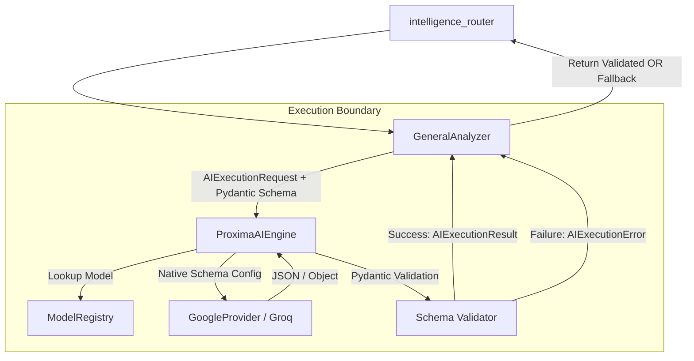

# Stage 7A.2 — AI Execution Contract & Unified Intelligence Boundary

## 1. Inspect the Existing Execution Flow

Currently, Proxima's analyzers independently orchestrate interactions with the `ModelRegistry` and LLM providers. There is no unified execution boundary.

### Execution Path Matrix

| Path | Router | Service | Prompt Retrieval | Prompt Assembly | Model Selection | Provider Call | Parsing | Validation | Fallback | API Response |
| :--- | :--- | :--- | :--- | :--- | :--- | :--- | :--- | :--- | :--- | :--- |
| **General Intelligence (Stream)** | `intelligence_router` | N/A | `PromptRegistry` | `PromptAssembler` | `get_default_generation()` | `stream_completion()` | Client-side (SSE) | None | Standard HTTP 500 | Streaming JSON strings |
| **General Analyzer** | `intelligence_router` | `GeneralDocumentAnalyzer` | Hardcoded string | f-string injection | `get_default_generation()` | `complete()` | Regex cleanup + `json.loads` | Pydantic (`GeneralAnalysisResult(**dict)`) | Custom deterministic dict | JSON |
| **Clinical** | `intelligence_router` | `ClinicalAnalyzer` | Hardcoded string | f-string injection | `get_default_generation()` | `complete()` | Regex cleanup + `json.loads` | Pydantic (`ClinicalResponseSchema`) | Custom deterministic dict | JSON |
| **Legal/Contract** | `intelligence_router` | `ContractAnalyzer` | Hardcoded string | f-string injection | `get_default_generation()` | `complete()` | Regex cleanup + `json.loads` | Pydantic | Custom deterministic dict | JSON |
| **Compare** | `intelligence_router` | `CompareAnalyzer` | Hardcoded string | f-string injection | `get_default_generation()` | `complete()` | Regex cleanup + `json.loads` | Pydantic (`CompareResponseSchema`) | Custom deterministic dict | JSON |
| **Code Suite** | `intelligence_router` | `CodeSuiteService` | Hardcoded string | f-string injection | `get_default_generation()` | `complete()` | Regex cleanup + `json.loads` | Pydantic (`CodeAnalysisResult` etc) | Custom deterministic dict | JSON |

**Where paths differ:**
- **Prompts:** General chat streaming uses the DB-backed `PromptRegistryService`, while specific analyzers (Clinical, General, Compare) use hardcoded `SYSTEM_PROMPT` strings.
- **Model Selection:** Some routing logic exists in `ModelRegistry`, but every analyzer explicitly calls `get_default_generation()` bypassing task/domain-based routing.
- **Validation:** Analyzers duplicate regex string stripping (removing ```json) and raw `try/except` blocks before calling Pydantic validation.
- **Streaming:** `/complete` streams raw text directly to the router. Analyzers wait synchronously for a full JSON completion.

## 2. Define the Proposed AI Execution Contract

The goal is to create `ProximaAIEngine` as a clean boundary that isolates analyzers from provider SDKs. **Crucially, `ProximaAIEngine` must NOT become a prompt-assembly system. `PromptRegistryService` and `PromptAssemblerService` remain strictly responsible for prompt retrieval and assembly.**

**Execution Request Contract (`AIExecutionRequest`)**
- `task_class`: str (e.g., 'general_analysis')
- `domain`: str | None
- `system_prompt`: str
- `user_message`: str
- `structured_output_schema`: Type[BaseModel] | None (Pydantic model class for validation)

*(Note: `temperature` and `max_tokens` are removed from the analyzer request. These belong in the ModelRegistry configuration or Execution layer defaults, as the existing architecture shows most analyzers simply hardcode standard defaults.)*

**Execution Result Contracts (Split for clarity)**

1. **`AIExecutionResult`** (For structured completions)
   - `validated_data`: BaseModel (Parsed and validated Pydantic object)
   - `provider`: str
   - `model_id`: str
   - `latency_ms`: int
   - `error`: AIExecutionError | None

2. **`AIStreamingResult`** (For streaming endpoints)
   - `content_stream`: AsyncGenerator
   - `provider`: str
   - `model_id`: str

*Justification:* Separating the result types creates the smallest, cleanest design, preventing the awkwardness of mixing a Pydantic object and an `AsyncGenerator` in the same field. Analyzers expect `validated_data`, while routers expect a stream.

## 3. Provider Boundary

Currently, `GoogleProvider` and `OpenAIProvider` handle SDK idiosyncrasies but push errors and schema generation directly into the service layer.

- **What belongs in the provider:** Executing the completion or stream. Leveraging native SDK structured outputs where supported.
- **What belongs in the execution layer (`ProximaAIEngine`):** Calling `ModelRegistry`. Calling the provider. Falling back to parsing JSON strings and stripping markdown if the provider doesn't support native structured outputs. Validating against the requested Pydantic schema. Catching errors and normalizing them.
- **What belongs in the analyzer:** Deterministic extraction. Assembling prompts (via `PromptAssembler` or internal rules). Defining the Pydantic schema class. Providing the fallback response.
- **What belongs in ModelRegistry:** Fetching DB configs and mapping `task_class/domain` to a provider and model.

*Constraint:* **Do not modify GoogleProvider merely for architectural symmetry.** Only modify providers if absolutely necessary to support the execution boundary.

## 4. Schema Strategy

**Problem:** Analyzers manually construct stringified JSON schema dumps to append to the system prompt, causing drift and duplicate logic.

**Stage 7A.2 Solution:** `Pydantic-Driven Validation with Native Provider Support`

1. Pydantic remains the **single authoritative output validation contract**.
2. The `ProximaAIEngine` will prefer **provider-native structured output** where supported (e.g., Gemini's `response_schema` or OpenAI's JSON mode). 
3. The engine will **not** blindly duplicate the full Pydantic JSON schema into prompts if the provider can enforce it natively.
4. If native support is missing or fails, the Engine acts as the safety net: stripping markdown, parsing JSON, and enforcing Pydantic validation.
5. If Pydantic validation fails, the Engine throws a `SchemaValidationError` so the analyzer can gracefully fallback.

## 5. Error Contract

We need a normalized error hierarchy to stop leaking `google.api_core.exceptions` or `httpx.TimeoutException` into analyzers.

**`AIExecutionError` (Base Class)**
- **`ProviderTimeoutError`**: Triggered by provider unresponsiveness.
- **`ProviderRateLimitError`**: Triggered by 429s.
- **`ProviderAuthenticationError`**: Bad API keys (Requires user intervention).
- **`SchemaValidationError`**: LLM returned invalid JSON or missed required Pydantic fields.
- **`UnknownExecutionError`**: Catch-all.

*Handling:* The Execution Layer catches SDK/Pydantic errors and maps them to these classes. Analyzers catch these to trigger their deterministic fallbacks.

## 6. Streaming

`intelligence_router.py`'s `/complete` endpoint relies on streaming.

If a stream is requested, `ProximaAIEngine` returns an `AIStreamingResult`. The engine acts as a pure pass-through to `model_registry.stream_completion()`. This explicitly preserves existing streaming behavior without over-engineering streaming JSON parsing.

## 7. Analyzer Migration Strategy

**Constraint:** `GeneralDocumentAnalyzer` is the ONLY analyzer to migrate in the first implementation. Do not migrate Clinical, Legal, Compare, or Code Suite yet.

| Phase | Target | Current Execution Path | Migration Difficulty | Risk |
| :--- | :--- | :--- | :--- | :--- |
| **Phase 1** | Boundary Definition | N/A | Low | Low |
| **Phase 2** | `GeneralDocumentAnalyzer` | Direct ModelRegistry call with manual JSON parsing | Low | Low |

*(Phases 3+ for other analyzers will be planned in future stages).*

## 8. Backward Compatibility

**Hard Constraints:**
- **API Response Contracts:** Must remain exactly identical.
- **Deterministic Fallbacks:** The robust fallback dictionaries built into `GeneralDocumentAnalyzer` must be perfectly preserved.
- **Frontend Behavior:** No frontend changes.
- **Streaming Behavior:** SSE format must remain perfectly intact.
- **Database/Prompts:** No changes to `PromptRegistry` behavior or existing DB models.

## 9. Testing Strategy

**Unit Tests (Fakes/Mocks):**
- `test_engine_schema_handling`: Ensure `ProximaAIEngine` leverages provider-native schema support correctly.
- `test_engine_pydantic_validation`: Ensure a successful JSON parse returns the instantiated `BaseModel`.
- `test_engine_error_mapping`: Mock provider timeouts and ensure `ProviderTimeoutError` is returned.

**Integration Tests:**
- Test `GeneralDocumentAnalyzer.analyze` using a mock provider that returns a valid JSON string, ensuring the final API shape is unchanged.

## 10. Observability Preparation

The `AIExecutionResult` explicitly tracks metadata required for later observability (Stage 7A.5):
- `latency_ms`, `provider`, `model_id`, `error_class`

## 11. What NOT to Build

Explicitly out of scope for Stage 7A.2:
- Vector Search / pgvector
- Celery Task Migration
- Automatic Provider Retries (Tenacity)
- Caching Layers
- LLM-as-a-judge for Confidence/QHE
- Refactoring the PromptRegistry
- New LLM Providers

## 12. Proposed File Changes

- **NEW `backend/proxima/services/execution/engine.py`**: Contains `ProximaAIEngine`, `AIExecutionRequest`, `AIExecutionResult`, `AIStreamingResult`.
- **NEW `backend/proxima/services/execution/errors.py`**: Normalized `AIExecutionError` hierarchy.
- **MODIFY `backend/proxima/services/general_document_analyzer.py`**: Migrate to use `ProximaAIEngine`. Remove manual JSON parsing and regex markdown stripping.

*(No modifications to `GoogleProvider` unless strictly necessary for the boundary. No modifications to `PromptRegistry`.)*

## 13. Architecture Diagram



## 14. Risk Analysis

| Risk | Impact | Likelihood | Mitigation |
| :--- | :--- | :--- | :--- |
| **Breaking Existing Analyzers** | High | Low | Migrate only `GeneralDocumentAnalyzer` first. |
| **Pydantic Validation Failures** | Medium | Medium | Ensure analyzer retains deterministic fallback if the Engine throws `SchemaValidationError`. |
| **Streaming Disruption** | High | Low | Engine acts as a pure pass-through for `AIStreamingResult`. |

## 15. Final Recommendation & Implementation Sequence

**Recommended Architecture:** Implement `ProximaAIEngine` as a lightweight middleware layer separating `GeneralDocumentAnalyzer` from Providers, standardizing Pydantic validation and error mapping without absorbing prompt assembly or model selection logic.

**Implementation Sequence:**
1. Create `backend/proxima/services/execution/errors.py`.
2. Create `backend/proxima/services/execution/engine.py`.
3. Refactor `backend/proxima/services/general_document_analyzer.py` to use the engine.
4. Run unit and integration tests.

### Definition of Done (DoD)
- [ ] `ProximaAIEngine` is implemented with distinct `AIExecutionResult` and `AIStreamingResult` return types.
- [ ] `GeneralDocumentAnalyzer` successfully uses the engine for its LLM call and Pydantic validation.
- [ ] API compatibility for `/api/intelligence/analyze` is 100% maintained (identical JSON response).
- [ ] Fallback behavior in `GeneralDocumentAnalyzer` works exactly as before when an error occurs.
- [ ] The engine correctly catches malformed JSON, throws a `SchemaValidationError`, and the analyzer gracefully falls back.
- [ ] The engine correctly maps a simulated provider timeout to a `ProviderTimeoutError`.
- [ ] No other analyzers (Clinical, Legal, CodeSuite) are modified.
- [ ] Backend tests pass.
- [ ] Code is linted and builds successfully.
