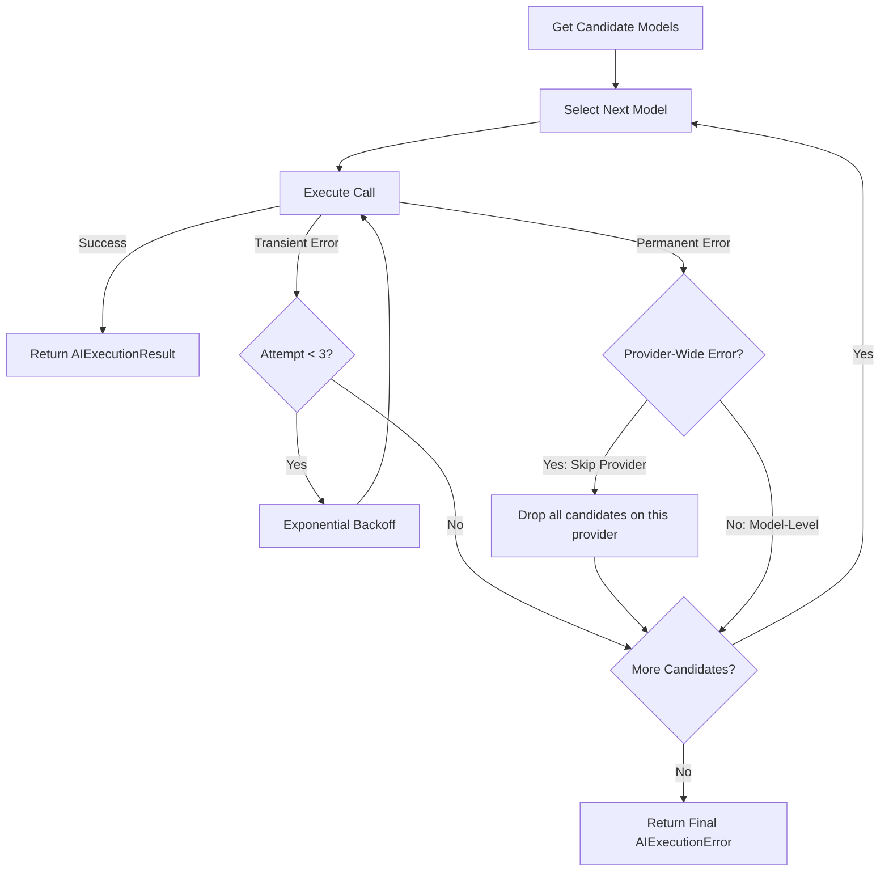

# Stage 7A — Consolidated Intelligence Core Implementation Plan (Revised)

This implementation plan outlines the revised design and execution sequence to harden Proxima's AI execution layer, focusing on **Provider Reliability**, **Schema Hardening**, and **Observability**.

---

## 1. Current-State Findings & Critical Analysis

### Critical Finding 1: Unpopulated `AIRequest` Database Model
The `AIRequest` database model in `backend/proxima/models/ai.py` is queried by the admin dashboard in `admin_router.py`. However, **there is currently no code in the entire repository that inserts records into the `ai_requests` table**.

### Critical Finding 2: Decoupled Audit Writing (Prevention of God Object)
Instead of polluting `ProximaAIEngine` with direct SQLAlchemy model creation and database writes, a lightweight `AIAuditor` service will handle writing execution telemetry to `ai_requests`. This preserves a clean separation of concerns: execution logic belongs in `ProximaAIEngine`, persistence belongs in `AIAuditor`.

### Critical Finding 3: Provider Signature Constraints & Heuristic Semantics
We cannot modify the return signatures of `GoogleProvider.complete()` or `OpenAIProvider.complete()` to return native token-usage objects because unmigrated analyzers call them directly.
*   **Resolution:** `ProximaAIEngine` will estimate input/output token counts locally. These values will be explicitly flagged as `estimated` in database entries and logs to avoid representing them as authoritative API usage.

---

## 2. Exact Files & Classes to Modify

-   **`backend/proxima/services/execution/engine.py`**
    -   Accept optional `user_id: UUID` and `document_id: UUID` in `AIExecutionRequest`.
    -   Implement the retry wrapper and candidate-routing fallback loop.
    -   Use `AIAuditor` to track execution records.
-   **`backend/proxima/services/execution/errors.py`**
    -   Add `is_transient: bool` property.
    -   Add `is_provider_wide: bool` property to distinguish failures like bad credentials or exhausted total quotas.
-   **`backend/proxima/services/execution/auditor.py` [NEW]**
    -   Lightweight service to create `AIRequest` database records and calculate estimated cost.
-   **`backend/proxima/services/model_registry.py`**
    -   Add `get_routing_candidates_for_task()` to return priority-ordered fallback candidate models.
-   **`backend/proxima/routers/intelligence_router.py`**
    -   Migrate `/complete` to `ProximaAIEngine.execute(..., stream=True)` for unified telemetry and error wrapping before stream initialization.

---

## 3. Provider Reliability (Retry & Fallback)

### Throttle vs. Quota (HTTP 429 Handling)
We distinguish temporary throttling (retryable) from permanent quota/billing exhaustion (non-retryable):
-   If the error message indicates account-wide quota limits or billing depletion (e.g., Google's `"Quota exceeded for quota metric 'Generate Content API requests'"` or Groq's `"Organization limit reached"`), it is classified as a permanent provider-wide error.
-   If the error is transient throttling (e.g. rate limit per minute or temporary traffic spikes), the engine applies exponential backoff:
    $$Delay = \min(8.0, 0.5 \times 2^{attempt}) + Jitter$$
-   If it is impossible to determine the distinction, the engine uses a conservative policy: a single retry after a fixed delay, followed by fallback.

### Model-Level vs. Provider-Wide Fallback
The engine evaluates the candidate model list but avoids useless routing loops:
-   **Model-Level Failure (Fallback):** If a model returns 503 (Service Unavailable) or 404 (Model Not Found), the engine falls back to the next candidate model.
-   **Provider-Wide Failure (Skip Provider):** If a candidate fails with a provider-wide error (e.g. `ProviderAuthenticationError` or permanent account quota exhaustion), the engine **skips all other candidate models on that same provider** and moves to the first candidate on a different provider.



---

## 4. Schema & Contract Hardening

1.  ** Authoritative Validation:** Pydantic remains the single output schema contract.
2.  **Native Output Preferences:** Standardize usage of `response_mime_type="application/json"` (Google) and `response_format={"type": "json_object"}` (Groq/OpenAI) via the engine.
3.  **Sanitization Fallbacks:** Consolidated post-response sanitization strips markdown fences (` ```json `) to recover malformed JSON payloads. If parsing or validation fails, a `SchemaValidationError` is returned.

---

## 5. Decoupled Observability & Persisted Telemetry

Telemetry is split into structured logging (via `structlog`) and persistent logging (via `AIAuditor`).

### AIAuditor Database Schema & Estimations
`AIAuditor` calculates estimates and persists them:
-   **Estimated Token Count:** approximated using character length (e.g. `len(text) / 4`).
-   **Estimated Cost:** `(estimated_input / 1M) * cost_per_1m_input + (estimated_output / 1M) * cost_per_1m_output`.
-   **Data Flags:** Database entries in `ai_requests` will label computed fields clearly as estimates.

### Observability Privacy Rules
-   **No Payloads:** ProximaAIEngine must **never** log `user_message`, `system_prompt`, `raw_response`, or complete documents.
-   **Redaction Filter:** Logs and errors are passed through a string cleaner to scrub API keys or OAuth headers.

---

## 6. Streaming Boundaries

Streaming (`AIStreamingResult`) and Structured Completions (`AIExecutionResult`) are handled over separate execution paths.
-   Streaming shares provider routing resolution, error classification, and initial telemetry.
-   **Retry Cordon:** Once the first byte/chunk of a stream has been successfully yielded to the router, **all retry or fallback actions are frozen**. A mid-stream failure yields an SSE error block and terminates.

---

## 7. Testing Strategy

We will implement unit and integration tests covering the following scenarios:
1.  **Retry Exhaustion:** Verify that transient errors (e.g. 504) trigger 3 retries and then return a failure result.
2.  **Model-vs-Provider Fallback:**
    -   *Model Failure:* Model A fails with 503; verify the engine falls back to Model B on the same provider.
    -   *Provider Failure:* Model A fails with 401 (Auth) or billing quota depletion; verify the engine drops all other models on that provider and jumps to a provider B model.
3.  **Authentication/Quota Failures:** Verify that 401 and permanent 429 quota exhaustion trigger instant fail-fast behavior.
4.  **Streaming Retry Boundaries:** Mock a stream failure before and after the first chunk, asserting that retries occur only before chunk delivery begins.
5.  **Telemetry Privacy:** Verify that error logs do not contain raw API keys or document contents.
6.  **Heuristic Cost Semantics:** Verify that persisted token counts are marked explicitly as estimated.

---

## 8. Regression Risks & Untouched Systems

-   **Zero changes** to `ClinicalAnalyzer`, `ContractAnalyzer`, `CompareAnalyzer`, `CodeSuiteService`.
-   **Zero changes** to the frontend code, templates, or PromptRegistry logic.

---

## 9. Recommended Implementation Order

1.  **Step 1:** Add `get_routing_candidates_for_task()` to `model_registry.py`.
2.  **Step 2:** Create `auditor.py` for decoupled database logging.
3.  **Step 3:** Implement retry, provider-skipping fallback, and stream cordoning in `engine.py`.
4.  **Step 4:** Migrate `/complete` endpoint in `intelligence_router.py`.
5.  **Step 5:** Run tests, confirm 100% backend compatibility, and check admin dashboard aggregation.
